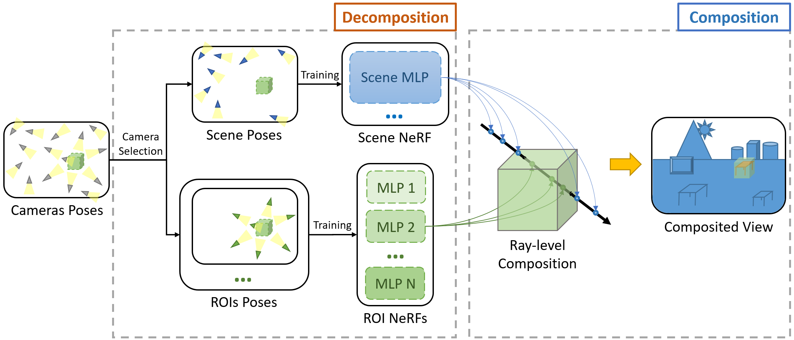

# ROI-NeRFs: Hi-Fi Visualization of Objects of Interest within a Scene by NeRFs Composition

This repository is a fork of [Nerfstudio](https://github.com/nerfstudio-project/nerfstudio), extended with a Region-of-Interest (ROI) decomposition-composition paradigm for high-fidelity neural rendering.

## Method Overview

ROI-NeRFs addresses the uniform level-of-detail limitation in standard NeRF pipelines by introducing the decomposition–recomposition concept on NeRFs to achieve efficient and detailed 3D reconstruction of complex scenes. 
The proposed ROI-NeRFs framework separates the scene into global and local NeRFs, each optimized for different levels of detail. 
A semi-automatic Camera Selection technique ensures Object-Focused training, while a Ray-Level Compositional Rendering strategy merges components seamlessly. 
The approach significantly enhances specific objects fidelity with minimal computational overhead.
The method builds primarily on the [Nerfacto](https://docs.nerf.studio/nerfology/methods/nerfacto.html) method of Nerfstudio.

<p align="center">
  
</p>

## Installation

1. Follow the [installation instructions of Nerfstudio](https://docs.nerf.studio/quickstart/installation.html).

2. Install additional dependencies:

```bash
pip install hydra-core --upgrade
pip install open3d
pip install opencv-python
```

3. Clone this repository and install:

```bash
git clone https://github.com/qanhbui/roi-nerfstudio
cd roi-nerfstudio/custom_method/nsob
python -m pip install -e .
```

4. Register the CLI extensions:

```bash
ns-install-cli
```

## Citation

If you find this work useful, please cite:

```bibtex
@inproceedings{bui2026roinerfs,
  title     = {ROI-NeRFs: Hi-Fi Visualization of Objects of Interest within a Scene by NeRFs Composition},
  author    = {Bui, Quoc-Anh and Rougeron, Gilles and Morin, Géraldine and Gasparini, Simone},
  booktitle = {International Conference on Computer Vision Theory and Applications (VISAPP)},
  year      = {2026}
}
```

## Acknowledgments

This project is built upon [Nerfstudio](https://github.com/nerfstudio-project/nerfstudio). We thank the Nerfstudio team for their excellent framework.